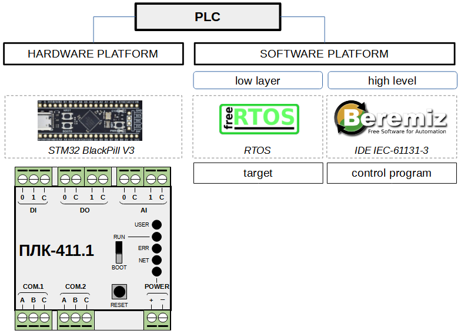

# PLC411

### Hardware Platform

- STM32 BlackPill V3
  - ARM Cortex-M4 32-bit RISC, Single-Core
  - System Clock 100 MHz
  - FLASH 512 kB
  - SRAM 128 kB
  - GPIO 36x
  - ADC 1x 12-bit 16-channels
  - RTC 1x
  - UART 3x
  - SPI 5x
  - I2C 3x
  - SWD 1x
  - Temperature sensor 1x (built-in, analog)
- Channels
  - DI 2x
  - AI 2x
  - DO 2x
  - COM 2x
  - Buttons 1x
  - Leds 5x

### Software Platform

- Target
  - FreeRTOS V10.4.6
  - CMSYS ARM Cortex-M
  - STM32 HAL
  - channels control
    - DI
      - off, normal input, pulse counter, tachometer, 1- or 2-channel incremental encoder 
      - minimum pulse period = 1 kHz
    - DO
      - off, normal output, fast output, PWM
      - minimum PWM period = 100 kHz
    - AI
      - off, survey
    - COM.1
      - software loader (firmware, user control program), IDE Beremiz debugger (user control program)
    - COM.2
      - ModBus RTU Slave Server
      - 115200 8 N 1, net.address = 1
      - ModBus protocol specification v.1.1b
  - control program execute
  - IDE Beremiz support
- Control program
  - IDE Beremiz YAPLC 1.2.0 PLC411

