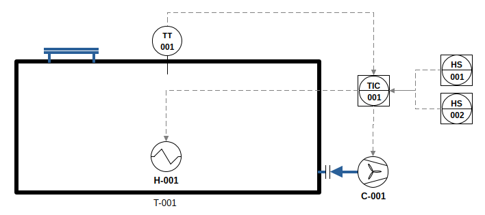
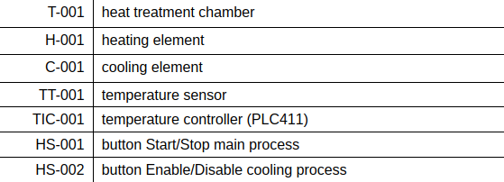
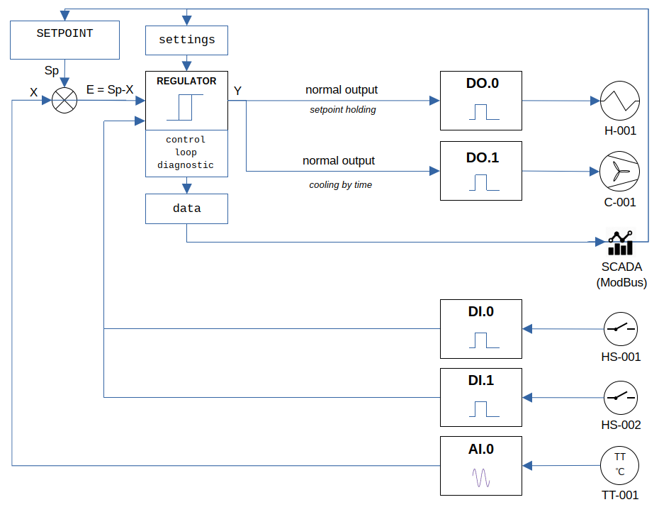

# PLC411

## YAPLC

- description of PLC411 target for IDE Beremiz YAPLC 1.2.0
  - IDE, RTE
- function blocks to control I/O channels
  - beremiz

[Beremiz YAPLC 1.2.0 PLC411 230505](https://disk.yandex.ru/d/YgRpB-NNpT3nmw)

## examples

- pro1003-heat-chamber

